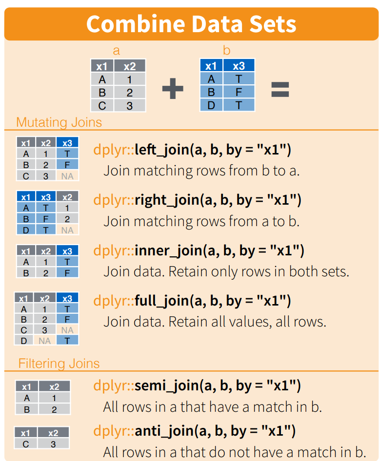

# INNER doubts

I have some experience coding in R, and I've found concepts from it surprisingly helpful when structuring SQL scripts. This article writes down some points about joins I don't recall seeing written down anywhere else but I always have in mind when writing and reviewing SQL. 

The most practical propositions are that:
- an `INNER JOIN` is an innapropriate operator for a **semi-join**, you really want `WHERE EXISTS` instead
- it's not appropriate to use a `LEFT JOIN` in the process of mimicking an **anti-join**, you really want `WHERE NOT EXISTS` instead

If you don't follow these practices, your code can produce the desired output in some circumstances (which requires extra work to manifest and/or verify), but the code is more misleading, less readable, and is more likely to do produce unintended results if people aren't paying enough attention.

Along the way I also share a simple but effective join taxonomy to justify these propositions and generally share how I think about joins in data transformation processes.

## "Huh... 'R'? I thought we're talking about SQL"

A common R library for manipulating data in R is `dplyr`, which belongs to the `tidyverse`. If this sounds like something out of the multiverse to you, don't worry it's not that important. In short-

"The `tidyverse` is an opinionated collection of R packages designed for data science. All packages share an underlying design philosophy, grammar, and data structures."

"`dplyr` is a grammar of data manipulation, providing a consistent set of verbs that help you solve the most common data manipulation challenges"

`dplyr` provides a useful vocabulary for thinking about data. I would recommend anyone who works with data to peruse the cheatsheet and consider their terminology when talking about data manipulation, _especially_ when it comes to joins. And whilst tidyverse is notably opinionated (as am I), I maintain the specific points I present in this article are broadly objective even when applying them to the SQL counterparts.

## The `dplyr` Join Taxonomy

`dplyr` categorises standard joins into two main categories: "mutating joins" and "filtering joins".

### Mutating Joins

The [official definition for mutating joins](https://github.com/tidyverse/dplyr/commit/d1a09ea983d64a63cc992ac0b2960029897453a3#diff-4d038e7d3049b82aa7e8316f95b7fcea6e992deabc99076b2e249b6159640016R4-R6):

```
Mutating joins add columns from `y` to `x`, matching observations based on the keys. 
```
In my own words- *Mutating joins facilitate adding values from one dataset to another based on a specified key.*

The mutating joins are: `inner`, `left`, `right`, `outer`. The context here is indeed an R package but you will rightgully recognise the same operations from SQL.

Aside- regarding nomencluture, the word "mutate" is also used for a `dplyr` function which creates a new column from existing columns in a dataset (like a basic SQL `SELECT` expression). So in `dplyr` "mutate" is generally used in the context of adding a column. To me, the name also reflects the idea that to "mutate" a table schema would be to "change" the table schema (which these joins facilitate). Given that background, the phrase "mutating joins" subsequently holds up for me (and hopefully you) as relatively self-explanatory terminology.

### Filtering Joins

The [official definition for filtering joins](https://github.com/tidyverse/dplyr/commit/d1a09ea983d64a63cc992ac0b2960029897453a3#diff-4d038e7d3049b82aa7e8316f95b7fcea6e992deabc99076b2e249b6159640016R4-R6):  
```
Filtering joins filter rows from `x` based on the presence or absence of matches in `y`:
```

The filtering joins are: `semi`, `anti`. Their properties are as follows:

```
`semi_join()` return all rows from x with a match in y.

`anti_join()` return all rows from x without a match in y.
```

Whilst there are no ANSI SQL operators that share the same name, it is common to see the functionality of these operators mimicked in SQL. More on that later.



## The Taxonomy as a Decision Tree

The distinction between mutating and filtering joins is incredibly useful...:

1) *...when reviewing, as it tells us how joins should be interpreted when they encountered*- `inner`, `left`, `right`, `outer` are all mutating joins, not filtering joins. So when I see them, I expect/hope they are being used to mutate the table schema in the script's "story".

2) *...when developing, by limiting the set of joins which should be considered when selecting a join*- a mutating join would ideally only be used when seeking to mutate, and a filtering join would ideally only be used when seeking to (...you guessed it...) filter.

(These go hand-in-hand. If seeking to develop in a way that prioritises readability, it helps to know how the operators we're considering should be read/interpreted/reviewed, otherwise our script is at greater risk of misdirecting readers.)

It follows that if a mutating join is present where mere-filtering is expected (or vice-versa), then there's been a suboptimal choice when choosing a join.

[join_decision_tree](joins.md) 

## Uh Oh- Violations Abound!

It might seem like choosing the wrong the join according to these straightforward guidelines is a difficult and odd mistake to make, but I suggest it's more common than you might expect.

In the wild I've frequently seen analysts and engineers of varying levels of experience reach for:
- an `INNER JOIN` (a mutating join) whilst trying to perform a semi-join (a filtering join)

- a `LEFT JOIN` (a mutating join), typically followed by a `WHERE RIGHT_TABLE.A_NONNULLABLE_FIELD IS NULL` condition where they intend to perform an anti-join (a filtering join)

...If you've worked with SQL scripts for some time I'd be surprised if you've never seen this occur. However both of these practices violate the idea that mutating joins shouldn't be used for mere-filtering.

## Why to Respect The Taxonomy

For any of the **mutating joins**, be it inner, left, right or outer, **the grain of the result depends on the grain of both inputs**. Specifically, if we think of the grain as a set of table fields, `grain_result = grain_left.union(grain_right)`. This is because an individual row of the left table can join to individual rows of the right table. 


This means that whenever they are used, mutating joins can change the grain of the working set depending on what the inputs are. And so as a reviewer[^1] whenever I see these join being used I immediately embark on the journey of seeing if the grain is impacted as sought. This journey entails the following quests: 

[^1]: when reviewing you're often trying to work out *what* a developer is *trying* to achieve in specific parts of their code whilst *actively digesting and assessing the entirity of what they've actually produced*. Since there are often multiple ways of doing things, you don't know all the answers ahead of time, and so you're often trying to solve many questions to understand what's in front of you as you're going along. This is non-trivial yet common, especially when you've assigned issues with decent autonomy. 

- considering whether it's potentially appropriate for the grain to be changed at this point in the script and if so having an opinion on what the new grain should be
- checking the grain of source one (*ok fine I concede this one would already be done anyways*)
- checking the grain of source two
- understanding the grain of the join's result set 
- comparing the produced grain to what the sought grain is

... If we didn't want to change the grain, this is all excessive mind-compute triggered by the sight of an innappropriately placed mutating join (*sigh*). 

In contrast, a **filtering join never changes the grain** of the source table you're filtering from. 

Thus if all we want to do is filter, using a mutating join along the way poses more pitfalls and risks, and introduces more work than necessary.  So, if as a reviewer I know we don't actually want to change the grain, I'll recommend that we use a filtering join rather than a mutating join so that I (and others) don't have to worry about the grain being incidentally impacted.

Another way of saying this is I'll support the use of an `INNER JOIN` (or any mutating join for that fact), if and only if the developer understandably intends to:
- use values from two tables in the corresponding `SELECT` query, and/or
- change the grain

...Otherwise I think the mutating join is suggesting the wrong thing at that point in the code. There are better alternatives for mimicking a filtering join.

## "`WHERE` in SQL, do 'Filtering Joins' `EXIST`?"

At this point, a fed up SQL dev might respond "okay fine, but where even is this mythical `SEMI JOIN` or `ANTI JOIN` you speak of".

Reasonable question, in ANSI SQL there's no `SEMI JOIN` or `ANTI JOIN`, so we have to find alternatives to mimick these operations. 

When as a grad I sought advice on mimicking semi-joins and anti-joins in SQL, I got *bad* advice (hence the trauma and this blog) from well-intending people. They involved using *mutating* joins (*shudder*). Don't gasp you elitist, if you work with SQL scripts I'd be surprised if you haven't saw these methodologies in the wild (but pleased if that's true).

Let's start with that *bad* answer.

#### Naive SEMI JOIN

```
-- [PLEASE AVOID, for example only] 

-- A *naive* SEMI JOIN (specifically A.semi_join(B))

-- Note: This CTE is often skipped if the dev thinks joining A and B directly would result in the same grain as A
-- WITH 
--     B_DEDUPED AS ( 
--         SELECT DISTINCT set(JOIN_KEYS_IN_B)
--         FROM B
--     )

SELECT A.*
FROM A
    INNER JOIN B_DEDUPED
    ON [JOIN CONDITION]
```

#### Naive ANTI JOIN

```
-- [PLEASE AVOID, for example only] 

-- A *naive* ANTI JOIN (specifically A.anti_join(B))

-- Note: This CTE is often skipped if the dev thinks joining A and B directly would result in the same grain as A
-- WITH  
--     B_DEDUPED AS (
--         SELECT DISTINCT set(JOIN_KEYS_IN_B)
--         FROM B
--     )

SELECT A.*
FROM A
    LEFT JOIN B_DEDUPED
    ON [JOIN CONDITION]
-- A's row didn't join to any B
WHERE B.JOIN_KEY_FIELD IS NULL 
```

The above methods use mutating joins in the process of mimicking a filtering join which already I've made clear is *gross*, but hopefully the potential CTE specifically illustrates how if we *wanted* to use an mutating join in the process of mimicking a filtering join, we would need to ensure that the lookup table's grain is a subset of the grain of the table we are trying to filter. This requires inspecting the lookup table's grain and potentially introducing a supplementary CTE (see `B_DEDUPED`). This is extra work for the developer and probably even more for the reviewer. Avoiding this would be nice.

I've laboured the point now, we can do better than the above. There's a `WHERE EXISTS` operator that can be used in the following ways...


#### RECOMMENDED SEMI JOIN


```
-- A SEMI JOIN (specifically A.semi_join(B))

SELECT A.*
FROM A
WHERE EXISTS (
    SELECT 1
    FROM B
    WHERE [JOIN CONDITION]
)
```

#### RECOMMENDED ANTI JOIN

```
-- An ANTI JOIN (specifically A.anti_join(B))

SELECT A.*
FROM A
WHERE NOT EXISTS (
    SELECT 1
    FROM B
    WHERE [JOIN CONDITION]
)
```
Sure the `EXISTS` operator can be new for a lot of folks, but I strongly think the `WHERE EXISTS` pathway is something devs should familiarise themselves with and is what they should reach for when seeking to perform a semi or anti join. They have desirable properties:
1) The filtering join is expressed in the `WHERE` clause as a filter... very sensical
2) We're not at risk of changing the grain when filtering... very desirable
3) The difference between semi and anti (which can be thought to be opposites in a sense) is simply the `NOT` (ie. negation) operation... very sensical

## Outro

I hope from this: 
- To increase familiarity with the "mutating" and "filtering" join terminology, including a shared understanding of what distinguishes them, and when either should be used 
- we see `SEMI JOIN`s and `ANTI JOIN`s implemented using `WHERE (NOT) EXISTS` in the wild
