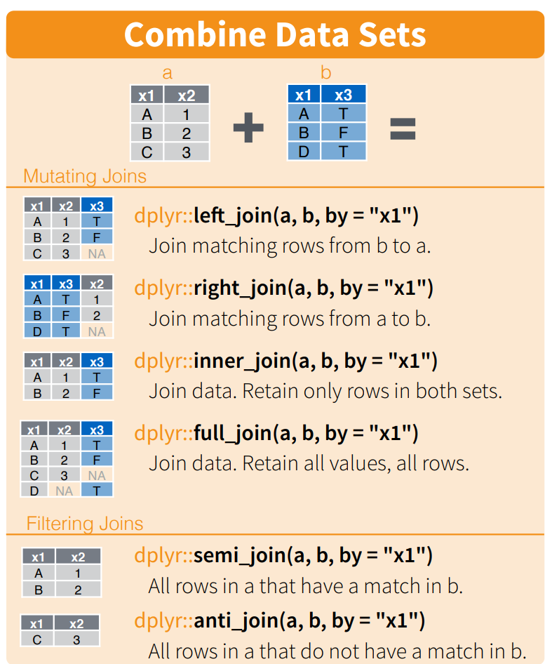

# `INNER` Doubts

## Intro

I have some experience coding in R, and I've found concepts from it surprisingly helpful when structuring SQL scripts. This blog writes down some points about joins I don't recall seeing written down anywhere else but I always have in mind when writing and reviewing SQL.

### The *TLDR*

The most specific takeaways are:
- the `INNER JOIN` operator is innapropriate in the process of mimicking a **semi join**, use `WHERE EXISTS` instead
- the `LEFT JOIN` operator is innapropriate in the process of mimicking an **anti join**, use `WHERE NOT EXISTS` instead

If you don't follow these practices, your code can produce the desired output in some circumstances (which requires extra work to manifest and/or verify), but I argue the code is more misleading, less readable, and is more likely to do produce unintended results if people aren't paying enough attention to primary keys and join cardinality.

Along the way I also share a simple but effective join taxonomy ('mutating joins' and 'filtering joins') from R for justification and to generally share how I think about joins in data transformation processes.

## 'Huh... "R"? I thought we're talking about SQL'

A common R library for manipulating data in R is `dplyr`, which belongs to the `tidyverse`. If this sounds like something out of the multiverse to you, don't worry it's not that important. In short-

'The `tidyverse` is an opinionated collection of R packages designed for data science. All packages share an underlying design philosophy, grammar, and data structures'.

'`dplyr` is a grammar of data manipulation, providing a consistent set of verbs that help you solve the most common data manipulation challenges'.

`dplyr` provides a useful vocabulary for thinking about data. I would recommend anyone who works with data to peruse the cheatsheet and consider their terminology when talking about data manipulation, _especially_ when it comes to joins. And whilst tidyverse is notably opinionated (as am I), I maintain the specific points I present in this blog are broadly objective even when applying them to the SQL counterparts.

## The `dplyr` Join Taxonomy

`dplyr` categorises standard joins into two main categories: 'mutating joins' and 'filtering joins'.

### Mutating Joins

The [official definition for mutating joins](https://github.com/tidyverse/dplyr/commit/d1a09ea983d64a63cc992ac0b2960029897453a3#diff-4d038e7d3049b82aa7e8316f95b7fcea6e992deabc99076b2e249b6159640016R4-R6):

```
Mutating joins add columns from `y` to `x`, matching observations based on the keys. 
```
In my own words- *Mutating joins facilitate adding values from one dataset to another based on a specified key.*

The mutating joins are: `inner`, `left`, `right`, `outer`. The context here is indeed an R package but you will rightgully recognise the same operations from SQL.

An aside- regarding nomencluture, the word 'mutate' is also used for a `dplyr` function which adds a new column derived from pre-existing columns in a dataset. So in `dplyr` 'mutate' is already assoicated with adding a column. To me, the term also reflects the idea that to mutate a table schema would be to change the working set's schema (which these joins facilitate). Given that background, hopefully the term 'mutating join' makes more sense.

### Filtering Joins

The [official definition for filtering joins](https://github.com/tidyverse/dplyr/commit/d1a09ea983d64a63cc992ac0b2960029897453a3#diff-4d038e7d3049b82aa7e8316f95b7fcea6e992deabc99076b2e249b6159640016R4-R6):  
```
Filtering joins filter rows from `x` based on the presence or absence of matches in `y`:
```

The filtering joins are: `semi`, `anti`. Their properties are as follows:

```
`semi_join()` return all rows from x with a match in y.

`anti_join()` return all rows from x without a match in y.
```

Whilst there are no ANSI SQL operators that share the same name, it is common to see the functionality of these operators mimicked in SQL. More on that later.



## The Taxonomy as a Decision Tree

The distinction between mutating and filtering joins is incredibly useful...:

1) *...when reviewing, as it tells us how joins should be interpreted when they encountered*- `inner`, `left`, `right`, `outer` are all mutating joins, not filtering joins. So when I see them, I expect/hope they are being used to mutate (ie. change) the working set's table schema.

2) *...when developing, by limiting the set of joins which should be considered when selecting a join*- a mutating join would ideally only be used when seeking to mutate, and a filtering join would ideally only be used when seeking to (...you guessed it...) filter.

(These go hand-in-hand. If seeking to develop in a way that prioritises readability, it helps to know how the operators we're considering should be interpreted by readers, otherwise our script is at greater risk of misdirecting readers.)

It follows that if a mutating join is present where  only filtering is expected (or vice-versa), then there's been a suboptimal choice when choosing a join.

We can visualise all of this as a simple decision tree:


## Uh Oh- Violations Abound!

In the wild I've frequently seen many reach for:
- an `INNER JOIN` (a mutating join) whilst intending to perform a semi join (a filtering join)

- a `LEFT JOIN` (a mutating join), typically followed by a `WHERE RIGHT_TABLE.JOIN_KEY_FIELD IS NULL` condition whilst intending to perform an anti join (a filtering join)

...If you've worked with SQL scripts for some time I'd be surprised if you've never seen this occur. Both of these practices violate the idea that mutating joins shouldn't be used when only needing to filter.

## Why to Respect The Taxonomy

Using any mutating join invokes the need to consider what the primary key of the result will become, based on the join's cardinality. In some cases the result's primary key will be different to either input's primary key, and it can look like rows are being duplicated in the output. In contrast, a filtering join will *never* change the primary key or duplicate any rows from either of its inputs. 

So if all we want to do is filter, using a mutating join along the way poses more pitfalls and risks, and introduces more work than necessary. If as a reviewer I see we're not actually using values from both inputs in the join's result set, I'll recommend that we use a filtering join rather than a mutating join so that I (and others) don't have to think about a changing primary key or worry about producing 'dupes'.

Another way of saying this is I'll support the use of an a mutating join if and only if the developer understandably intends to use values from both inputs in the corresponding `SELECT` query (whether that's to change the primary key or otherwise)... otherwise I think the mutating join is suggesting the wrong thing at that point in the code. There are better alternatives that help mimick a filtering join.

Read the following subsections to understand more about how mutating joins and filtering joins differ with respect to their output's primary keys and how they are influenced by the join's cardinality, otherwise feel free to skip ahead to the "So *Where* in SQL do Filtering Joins *Exist*?" section if the ideas are familiar enough.

### Primary Keys

The primary keys of a table are the set of columns which identify a record, and thereby indicate what any non-primary key columns are providing information about.

For any ***mutating join***, be it an inner, left, right or outer join, ***the primary keys of the result will depend on the primary keys of both inputs***. This is because an individual row of the left input can match to individual rows of the right input, and all matches are kept in the result. This means that whenever they are used, mutating joins can change the primary key of the working set depending on what the inputs are.  

And so as a reviewer[^1] whenever I see a mutating join being used I immediately embark on the sudden journey of assessing how the primary key might be impacted. This journey implicitly entails the following quests: 

[^1]: when reviewing you're often trying to work out *what* a developer is *trying* to achieve in specific parts of their code whilst *actively digesting and assessing the entirity of what they've actually produced*. Since there are often multiple ways of doing things, you don't know all the answers ahead of time, and so you're often trying to solve many questions to understand what's in front of you as you're going along. This is non-trivial yet common, especially when you've assigned issues with decent autonomy. 

- considering whether it's potentially appropriate for the primary key to be changed at this point in the script and if so having an opinion on what the new primary key should be
- reminding myself what the primary key of source one is
- checking the primary key of source two
- understanding the primary key of the join's result set 
- comparing the sought primary key to primary key actually produced by the code under review

In contrast, a ***filtering join never changes the primary key*** of the source table you're filtering from, as they only choose whether records from that source should be kept. So if we never intended to use values from both tables, the above primary key investigations are all excessive mind-compute triggered by the sight of an innappropriately placed mutating join (*sigh*). 

### Cardinality

The impact of a mutating join towards the working set's primary key is related to the join cardinality, which describes whether the join is a one-to-one, one-to-many or many-to-many join. Cardinality impacts the rows returned by mutating joins. If a mutating join is one-to-many or many-to-many, one input's row can appear multiple times in the output. In contrast, for filtering joins the cardinality of the join doesn't matter, a source table's row will appear at most once irrespective of whether it matches to one row or multiple rows from the other input.

## "So *Where* in SQL do Filtering Joins *Exist*?"

At this point, an anguished SQL dev might respond 'okay fine, but where even is this mythical `SEMI JOIN` or `ANTI JOIN` you speak of?'.

I think that's a very reasonable question. In ANSI SQL there's no `SEMI JOIN` or `ANTI JOIN`, so we have to find alternatives to mimick these operations. 

When I was a graduate I sought advice on mimicking semi-joins and anti-joins in SQL, at which point well-intending people advised me of implementations which counter to my overall advice here (hence the trauma and this blog in an attempt to stop the madness). They unwittingly but inherently suggested to use *mutating* joins in the process of mimicking these filtering joins (*shudder*). If you work with SQL scripts long enough you've probably seen these less flattering forms of mimickry too...


#### A Naive SEMI JOIN

```
-- [PLEASE AVOID, for example only] 

-- *Naive* SEMI JOIN pseudocode (specifically A.semi_join(B))

-- Note: This CTE is often skipped if the dev thinks joining A and B directly would result in the same primary key as A's primary key
-- WITH 
--     B_DEDUPED AS ( 
--         SELECT DISTINCT set(JOIN_KEYS_IN_B)
--         FROM B
--     )

SELECT A.*
FROM A
    INNER JOIN B_DEDUPED
    ON [JOIN CONDITION]
```

#### A Naive ANTI JOIN

```
-- [PLEASE AVOID, for example only] 

-- *Naive* ANTI JOIN pseudocode (specifically A.anti_join(B))

-- Note: This CTE is often skipped if the dev thinks joining A and B directly would result in the same primary key as A
-- WITH  
--     B_DEDUPED AS (
--         SELECT DISTINCT set(JOIN_KEYS_IN_B)
--         FROM B
--     )

SELECT A.*
FROM A
    LEFT JOIN B_DEDUPED
    ON [JOIN CONDITION]
-- only want rows from A which didn't join to any rows from B
WHERE B.JOIN_KEY_FIELD IS NULL 
```

The above methods use mutating joins in the process of mimicking a filtering join which I've already made clear is not my cuppa, but hopefully the potentially necessary CTE(/subquery) further illustrates how if we *wanted* to use an mutating join in the process of mimicking a filtering join, we would need to somehow ensure that the join cardinality is one-to-one. This is extra work for the developer and reviewers. Avoiding this would be nice.

I've laboured the point now, we can do better than the above. There's a `WHERE EXISTS` operator that can be used in the following ways...

#### Recommended SEMI JOIN

```
-- SEMI JOIN pseudocode (specifically A.semi_join(B))

SELECT A.*
FROM A
WHERE EXISTS (
    SELECT 1
    FROM B
    WHERE [JOIN CONDITION]
)
```

#### Recommended ANTI JOIN

```
-- ANTI JOIN pseudocode (specifically A.anti_join(B))

SELECT A.*
FROM A
WHERE NOT EXISTS (
    SELECT 1
    FROM B
    WHERE [JOIN CONDITION]
)
```
From my own experience the `EXISTS` operator can be new and therefore daunting for many, but I strongly think `WHERE EXISTS` is something SQL devs should familiarise themselves with, and is what they should reach for when seeking to perform a semi or anti join. Notice the desirable properties:
1) The filtering join is expressed in the `WHERE` clause as a filter... very sensical
2) We're not at risk of changing the primary when filtering... very desirable
3) The difference between semi and anti (which can be thought to be opposites in a sense) is simply the `NOT` (ie. negation) operation... very sensical

## Outro

I hope from this: 
- To increase familiarity with the 'mutating' and 'filtering' join terminology, including a shared understanding of what distinguishes them, and when either should be used 
- we see `SEMI JOIN`s and `ANTI JOIN`s implemented using `WHERE (NOT) EXISTS` in the wild

Happy engineering, catch you next time.

## For Extra Discussions 

My recommendations in this piece aim to maximise readability. They do not consider performance. It's hard to make blanket  statements about performance solely from comparing how a SQL query is written, not least since it's up to each database implementation to decide how it optimises queries and executes them under the hood. In any case I'd would be remiss of me to note that at least one quality analysis tool advises *against* using `EXISTS` for performance reasons in at least one SQL programming language derivative. Specifically, SonarQube advises against uses `EXISTS` in PL/SQL code:

"SQL queries that use EXISTS subqueries are inefficient because the subquery is re-run for every row in the outer query’s table. There are more efficient ways to write most queries, ways that do not use the EXISTS condition." (source: https://rules.sonarsource.com/plsql/RSPEC-1138/)

I consider that advice to be a special case for the associated Oracle DB technology, rather than a general recommendation to avoid using `EXISTS` in all SQL. But worth being mindful that in some settings there could be performance implications to using `EXISTS`.
